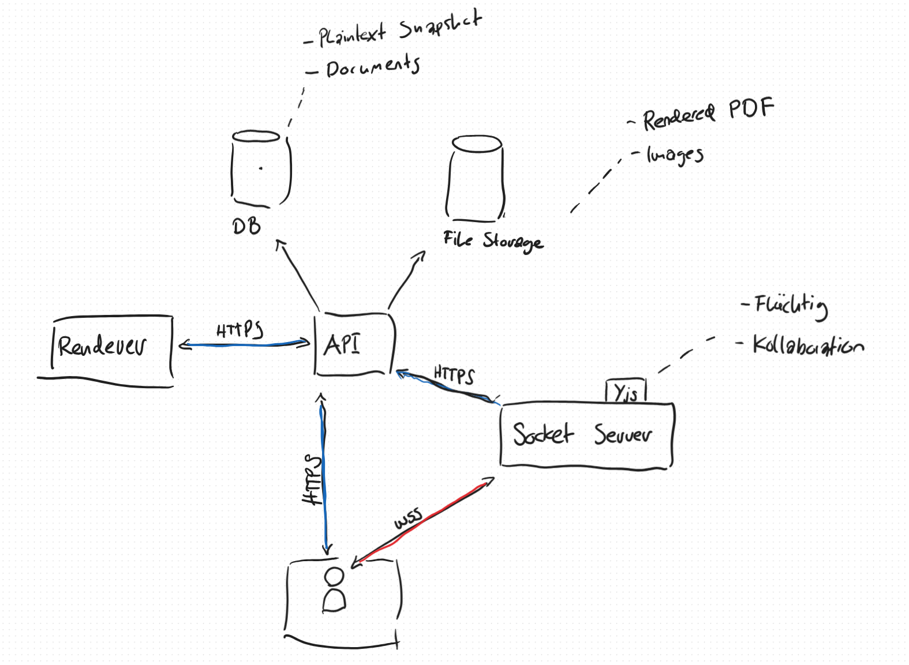

#  Architecture

## System overview
Below is a high-level overview of the system components and how they interact with each other.



## Components
Each of the following components will be published as a docker container.

| Component           | Description                                                                                                                                                                       | Technologies     |
| ------------------- | --------------------------------------------------------------------------------------------------------------------------------------------------------------------------------- | ---------------- |
| Frontend            | Web UI                                                                                                                                                                            | React.js<br>vite |
| API                 | Provides endpoints for<br>- querying document templates<br>- querying documents & their contents<br>- storing document snapshots<br>- render document as a PDF<br>- upload images | Java Spring Boot |
| Renderer            | Produces PDF files from valid LaTeX code                                                                                                                                          | Java Spring Boot |
| Websocket Server    | Holds the remote Yjs document and <br>provides a websocket endpoint to<br>communicate changes to the document                                                                     | Node.js          |
| File storage bucket | File storage for<br>- uploaded images<br>- generated PDFs                                                                                                                         | MinIO            |
| Database            | Persistence for<br>- Documents & Snapshot-Content<br>- Document templates                                                                                                         | PostgreSQL       |

## Folder structure
```
/docs
/src
	/api
	/frontend
	/renderer
	/sync-server
```
