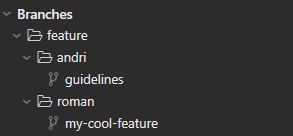

# Git Guidelines

## 🔀Branching

### **DO** _Develop features in feature branches_

> [!NOTE]
> Why?
>
> - Incomplete and experimental work is kept away from the `main` branch
> - Allows the creation of pull requests
> - Enables continuous integration to run on a pull request before merging into `main`

### **DO** _Name branches like `feature/{NAME}/{DESCRIPTION}`_

where `{NAME}` is your firstname and `{DESCRIPTION}` is a short identifier that describes your feature. e.g:

- `feature/marc/my-cool-feature`
- `feature/gregor/try-out-stuff`

> [!NOTE]
> Why?
>
> - Allows us to distinguish who is working on which features
> - Is represented by folders in the [Fork](https://fork.dev) git client 

## 📦 Commit Conventions

### **DO** _Use conventional commit naming rules_

See [Conventional Commits Naming Guidelines](https://www.conventionalcommits.org/)

> [!NOTE]
> Why?
>
> - Makes the git history easier to read and changes easier to grasp
> - It better communicates what a change represents

## 🚀 Pull requests

### **DO** _Keep pull requests small and feature-focused_

> [!NOTE]
> Why?
>
> - Makes pull requests easier to review and to grasp
> - Reduces the lifetime of feature branches, therefor makes shipping of features quicker

### **CONSIDER** _Assigning team members to review your code_

> [!NOTE]
> Why?
>
> - Promotes knowledge sharing between team members
> - Encourages discussion on design decisions made by the author of the pull requests
> - Possibly catches bugs, that the author did not account for
